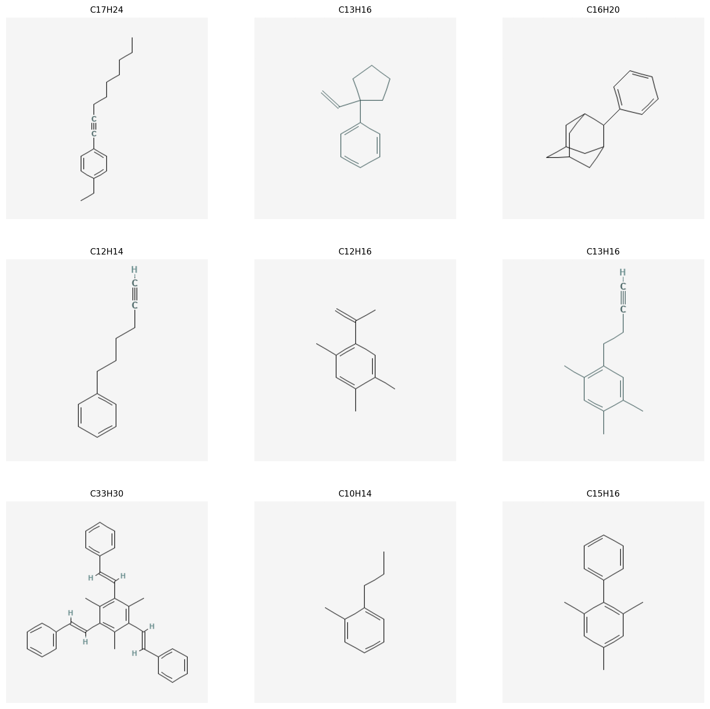
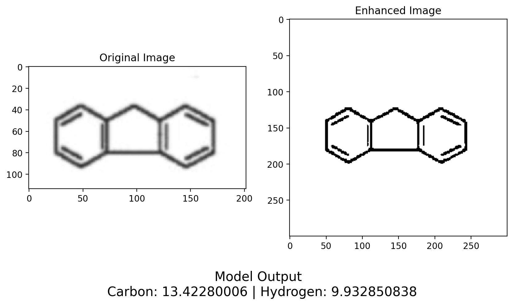

# Hydrocarbon Calculator (HCC) <!-- omit in toc -->
### A Machine Learning Model to Predict the Simplified Structural Formula of Hydrocarbons Structural Pictures <!-- omit in toc -->


This repository contains the code for the Hydrocarbon Calculator (HCC) project. The HCC is a machine learning model that predicts the simplified structural formula of hydrocarbons. Jupyter notebook for model inference is also provided in the repository.

📄 Want to read the paper? [Click Here](https://hcc.ericxin.eu/hcc.pdf)

😓 Link not working? Try to download from GitHub [Click Here](doc/HCC.pdf)

🌐 Prefer the online version? [Click here](https://hcc.ericxin.eu/)


## Table of Contents <!-- omit in toc -->
- [Introduction](#introduction)
- [Installation (with conda)](#installation-with-conda)
- [Model input and output](#model-input-and-output)
- [Model performance](#model-performance)
- [Model structure](#model-structure)
- [Future work / To-do](#future-work--to-do)
- [Code structure](#code-structure)
- [Data](#data)
- [Dataset and Model](#dataset-and-model)
- [Contact](#contact)
- [License](#license)

## Introduction
The Hydrocarbon Calculator (HCC) is a machine learning model that predicts the simplified structural formula of hydrocarbons. The model is trained on a dataset of 2000 hydrocarbons with their corresponding structural pictures. The model uses a convolutional neural network (CNN) to extract features from the structural pictures and predict the simplified structural formula of the hydrocarbons. The model achieves an accuracy of 99% on the test set.

## Installation (with conda)
```bash
conda create -n hcc python=3.8
conda activate hcc
pip install -r requirements.txt
```

Note that the model is not included in the repository due to the file size limitation of GitHub. You can download the pre-trained model followed by the instruction at [model readme](models/readme.md).

## Model input and output

**Input**: The model takes a structural picture of a hydrocarbon as input. The structural picture is a 2D image of the hydrocarbon's structure.

**Output**: The model predicts the simplified structural formula of the hydrocarbon (The number of carbon atoms and hydrogen atoms in the hydrocarbon).

**Input Examples**


## Model performance

Training curve as follows:


The model performs well on the test set with an accuracy of 99%.

**Test set information**



**Model inference on the test set** 


We can find that the model has a high accuracy on the test set. Notably, the model also predicted the simplified structural formula of highly complex hydrocarbons with spacial structures correctly. (For instance, the one on the top right corner of the test set information image)

I have also tested the model on a few examples excerpted from academic papers and the model has predicted the simplified structural formula of the hydrocarbons correctly.


*The ground truth for this sample is C13H10*

However, the model is not performing well on handwritten structural pictures of hydrocarbons. The model is trained on structural pictures generated by a software and may not generalize well to handwritten structural pictures.


*The ground truth for this sample is C6H6*

One of the possible reason for this is that handwritten chemical structures consists of lines that are not drown parallel or not connected properly. For the above example, the model might neglect some of the double bonds as they are not parallel to the other bonds.

## Model structure
The model consists of a convolutional neural network (CNN) with the following architecture:
- Convolutional layer with 32 filters and kernel size of 3x3, padding 1
- Convolutional layer with 64 filters and kernel size of 3x3, padding 1
- Convolutional layer with 128 filters and kernel size of 3x3, padding 1
- Max pooling layer with pool size of 2x2
- Flatten layer
- Dense layer with 512 units
- Output layer with 2 units (one for each class)
- ReLU activation function for hidden layers
- Softmax activation function for the output layer
- 
**Model visualization**


## Future work / To-do
- [ ] Add data transformation to get a larger dataset
- [ ] Improve the model performance on handwritten structural pictures of hydrocarbons
- [ ] Train the model on a larger dataset with more diverse hydrocarbons

## Code structure
The code is structured as follows:
```
.
├── assets
│   └── img # images for the readme file
├── doc # essay for the HCC project
├── data # dataset for the HCC project
├── model_inference.ipynb # notebook for model inference
├── models # trained models
│   ├── CNN_100_epoch_quantized_model.pth # quantized model, can be downloaded from Google Drive
│   └── readme.md
├── readme.md # readme file
├── requirements.txt # required packages
├── src # code for model classes, training, and evaluation
└── utils # utility functions
```

## Data
The data are prepared by myself. The dataset contains 2000 hydrocarbons with their corresponding structural pictures. The structural pictures are downloaded from the PubChem database. Special thanks to the PubChem researcher for providing help in parsing the special characters in the similes string.

## Dataset and Model
<!-- Since the datasets contains too many images, currently I cannot upload the dataset to the repository. Also, for the trained model, due to github's file size limitation, I can only upload the quantized version. If you are interested in the dataset or the full model, please feel free to contact me at [email](mailto:me@ericxin.eu) -->

Since the datasets contains too many images, currently I cannot upload the dataset to the repository. Also, for the trained model, due to github's file size limitation, I cannot upload the model to the repository. However, you can download the pre-trained model followed by the instruction at [model readme](models/readme.md).

## Contact
For any questions or feedback, please feel free to contact me at [email](mailto:me@ericxin.eu)

## License
This project is licensed under the MIT License - see the [LICENSE](LICENSE) file for details.