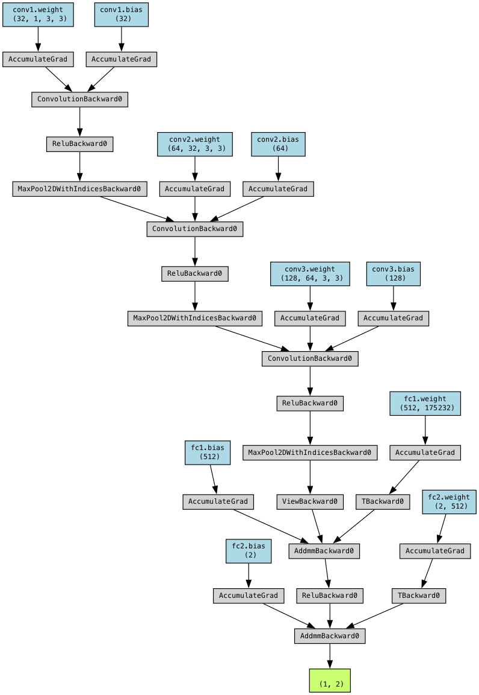

# About the model

Current a CNN model is used to predict the simplified structural formula of hydrocarbons.

For details about model performance, please refer to the [readme file](../readme.md#model-performance).

Below is a visualization of the model structure:

